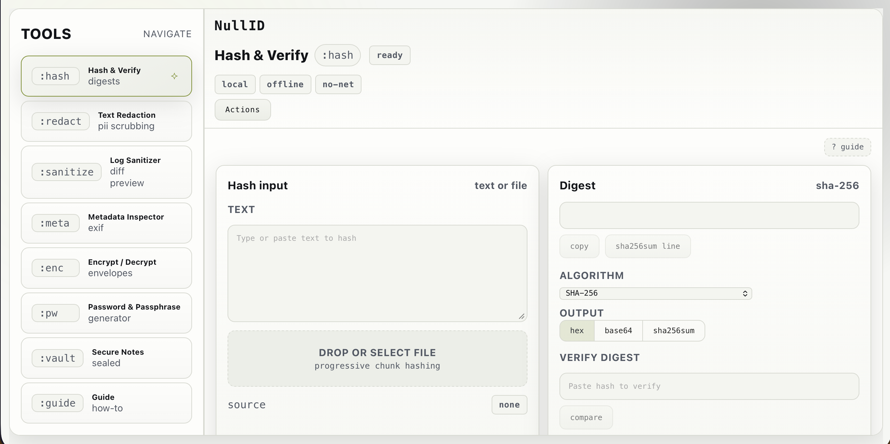

# NullID 🟨🖥️

An offline-first, terminal-style security toolbox built as a Vite + React + TypeScript SPA. Everything runs locally in your browser—no runtime network calls, no external CDNs, no analytics. Designed to feel like a real operator console: minimal, fast, and auditable.

## Preview 👀

## What’s inside 📂

- index.html – Minimal shell that mounts the app.
- src/ – React UI, tool modules, routing/state, and terminal-style layout.
- src/tools/ – Tool implementations (hashing, generators, encryption, redaction, sanitization, etc.).
- src/crypto/ – WebCrypto wrappers and versioned envelope utilities.
- src/storage/ – IndexedDB + local persistence (Vault, settings, exports/imports).
- public/ – Static assets (icons, manifest, any local wordlists).
- tests/ – Unit/integration tests for core utilities and tool correctness.

## What it does 🧰

- Hash & Verify: SHA-256 / SHA-512 / SHA-1 (legacy), text + chunked file hashing, verify mode.
- Password Generator: crypto.getRandomValues, presets, ambiguity toggle, entropy display.
- Passphrase Generator: local diceware-style list, configurable formatting, entropy display.
- Encrypt / Decrypt: versioned envelope (NULLID:ENC:1), PBKDF2 + AES-GCM, text + files, .nullid export.
- Secure Notes (Vault): IndexedDB-backed encrypted notes, auto-lock, export/import, wipe.
- Metadata Inspector: EXIF parsing for common images + re-encode stripping (limits clearly surfaced).
- Text Redaction: preset detectors + custom rules, mask modes, copy/download outputs.
- Log Sanitizer: presets for common log formats, diff-style reporting, replacement counts.
- Self-test: built-in diagnostics for hashing responsiveness, storage availability, and envelope round-trips.

## Safety notes 🔒

- No runtime network traffic by design.
  - Quick checks: rg "fetch" src and DevTools → Network tab (should stay empty).
- Crypto uses WebCrypto + local dependencies; no external services.
- “Wipe data” clears local storage and IndexedDB. Note: browsers/OSes may still retain remnants at the filesystem level (platform limitation).

## Compatibility notes 🌐

- Browsers: Chrome/Chromium, Firefox, and Safari are supported on desktop and mobile. Mobile layout uses touch-friendly horizontal nav when space is tight.
- Storage: Secure Notes prefers IndexedDB. If a browser blocks it (iOS private mode, quota issues), the app falls back to localStorage and surfaces a warning.
- Hashing & crypto: File hashing is chunked (2–4MB slices) with 50MB file caps to avoid OOM. Encryption caps files at 25MB. Text hashing limits input to ~1MB to stay responsive.
- Downloads: Envelope/file downloads use a Safari-safe anchor pattern with delayed URL revocation.
- Degraded environments: If clipboard/storage/IDB are blocked, the UI shows toasts instead of silently failing.

## Idea behind it 💡

NullID exists to provide a serious, local-first security toolkit you can run anywhere—especially on untrusted networks—without sending anything to a server. It’s built as a portfolio-grade demonstration of practical security UI, careful client-side crypto patterns, and disciplined offline behavior.

## Running locally 💻

- Install: npm ci
- Dev server: npm run dev (http://localhost:5173)
- Validate: npm run validate
- E2E (Playwright): npm run e2e
- Production build: npm run build
- Preview build: npm run preview

## Deploy 🚀

- npm run build emits the static site to dist/.
- For GitHub Pages, the workflow sets VITE_BASE to /${REPO_NAME}/ and publishes dist/.

## Contribution 🤝

Issues and PRs are welcome. If you add tools, please keep the footprint small and aligned with:
- offline-first behavior
- minimal dependencies
- explicit formats and clear failure modes
- no telemetry, no external CDNs
