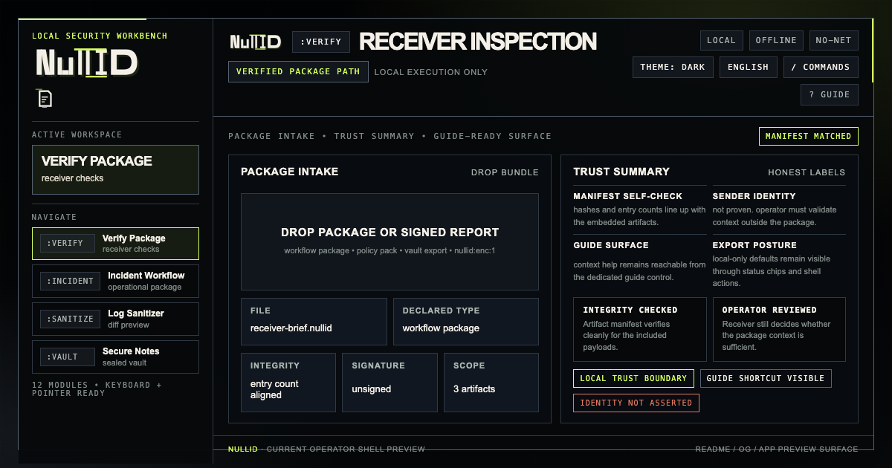

# NullID
Offline-first security toolbox for hashing, redaction, sanitization, encryption, secure local notes, and password storage hashing, with a browser-first UI, a local Node CLI for supported automation workflows, and no external services.



## Table of Contents
1. [Overview](#overview)
2. [Why NullID](#why-nullid)
3. [Core Capabilities](#core-capabilities)
4. [Tech Stack](#tech-stack)
5. [Quick Start](#quick-start)
6. [CLI Quick Examples](#cli-quick-examples)
7. [Configuration](#configuration)
8. [Scripts](#scripts)
9. [Deployment](#deployment)
10. [Security Model and Limits](#security-model-and-limits)
11. [Quality Gates](#quality-gates)
12. [Project Structure](#project-structure)
13. [Contributing](#contributing)
14. [FAQ](#faq)
15. [Current Status and Roadmap](#current-status-and-roadmap)
16. [License](#license)

## Overview
NullID is a Vite + React + TypeScript single-page app designed as a local security workbench. It also ships a local Node CLI (`scripts/nullid-local.mjs`) so browser usage and automation-friendly offline workflows stay aligned for the tools the CLI exposes.

Current release line:
- `0.1.0` (release-candidate baseline)

Shared workflow artifact contract:
- `nullid-workflow-package` is the versioned local JSON contract for inspectable workflow bundles and reports with artifact-manifest integrity metadata.
- The app `Safe Share Assistant` now exports this contract directly, and sanitize safe-share bundles still embed it for compatibility.
- Both the app `Verify Package` surface and CLI `package-inspect` can inspect it.
- Trust remains explicit: workflow packages are currently unsigned, top-level workflow metadata is package-declared unless separately hashed, and shared-passphrase HMAC applies to profile/policy/vault flows rather than workflow package signatures.

Focused modules in the app:
- Hash and Verify
- Safe Share Assistant
- Incident Workflow
- Text Redaction
- Log Sanitizer
- Verify Package
- Metadata Inspector
- Encrypt and Decrypt
- Password and Passphrase Generator
- Secure Notes Vault
- Self-test Diagnostics
- Built-in Guide

CLI commands include:
- `hash`
- `sanitize`
- `sanitize-dir`
- `bundle`
- `package-inspect`
- `redact`
- `enc`
- `dec`
- `pwgen`
- `pw-hash`
- `pw-verify`
- `meta`
- `pdf-clean`
- `office-clean`
- `archive-sanitize`
- `precommit`
- `policy-init`

## Why NullID
- Keep sensitive processing local: no runtime API calls or backend requirements.
- Give teams one toolchain for browser usage and terminal automation.
- Preserve reproducibility and release trust with deterministic build metadata (`deploy-manifest.json`, `SHA256SUMS`, `dist/sbom.json`).
- Make operational security tasks faster for incident response, developer logs, and secure note handling.

## Core Capabilities
- Hash and verify: SHA-256, SHA-512, and SHA-1 (legacy) for text/files with digest comparison.
- Safe Share Assistant: guided local producer flow for preparing text snippets or files to share safely with workflow presets, findings review, optional metadata cleanup, optional `NULLID:ENC:1` wrapping, and receiver-friendly package export.
- Incident Workflow: guided local incident producer flow for case context, responder notes, prepared artifacts, metadata review, transform logging, and receiver-friendly incident package export.
- Text redaction: detector-based masking for common secrets/PII (including GitHub/Slack tokens and private key blocks) with overlap-safe conflict handling.
- Log sanitization: presets and custom policies, structured-format support (`text/json/ndjson/csv/xml/yaml`), safe-share bundle export, and token/key-block stripping controls.
- Workflow packaging: versioned `nullid-workflow-package` metadata for Safe Share Assistant exports, Incident Workflow exports, and sanitize safe-share bundles, with SHA-256 artifact manifests plus shared report vocabulary for package scope and limits.
- Receiver verification: local inspection of workflow packages, safe-share bundles, policy packs, profile snapshots, vault snapshots, and `NULLID:ENC:1` envelopes with honest trust labels that separate integrity-checked artifacts from package-declared metadata.
- Metadata inspection/cleanup: image metadata parsing with local clean re-encode flows; CLI support for PDF and Office cleanup.
- Encryption and vault workflows: versioned `NULLID:ENC:1` envelopes with authenticated encryption, configurable KDF profiles, and encrypted local vault storage.
- Password storage hashing lab: local salted one-way record generation/verification with `Argon2id` (recommended when available), `PBKDF2-SHA256` (compat), and legacy SHA options kept only for migrations.
- Secure UX affordances: panic lock (`Ctrl+Shift+L`), unlock rate limiting, optional human-check challenges, optional local WebAuthn MFA for vault unlock, clipboard hygiene helpers, shared-passphrase HMAC export/import verification dialogs, and session-cookie presence signaling.
- Installable PWA: desktop/mobile support with offline app-shell caching.

## Tech Stack
- Frontend: React 18, TypeScript 5, Vite 5
- Cryptography: WebCrypto (`PBKDF2`, `AES-GCM`, runtime-dependent `Argon2id`) and `@noble/hashes`
- Storage: IndexedDB with localStorage fallback for vault data when restricted runtimes block IndexedDB
- Testing: Node test runner + Playwright end-to-end coverage
- Packaging path: optional Tauri bootstrap under `desktop/tauri`

## Quick Start
Requirements:
- Node.js 18+ (newer LTS recommended)
- npm

Install dependencies:

```bash
npm ci
```

Run the web app:

```bash
npm run dev
```

Dev URL:
- `http://127.0.0.1:4173`

Run the full validation pipeline:

```bash
npm run validate
```

Check CLI help:

```bash
npm run cli -- help
```

## CLI Quick Examples
Hash a file:

```bash
npm run cli -- hash ./artifact.bin --algo sha512
```

Sanitize one log file:

```bash
npm run cli -- sanitize ./raw.log ./clean.log --preset nginx
```

Sanitize an entire directory with a baseline policy:

```bash
npm run cli -- sanitize-dir ./logs ./logs-clean --baseline ./nullid.policy.json --ext .log,.json --report ./sanitize-report.json
```

Create and inspect a safe-share workflow package:

```bash
npm run cli -- bundle ./raw.log ./nullid-safe-share-bundle.json --preset nginx
npm run cli -- bundle ./raw.log ./nullid-safe-share-bundle.json --preset nginx --workflow support-ticket
npm run cli -- bundle ./raw.log ./nullid-safe-share-bundle.json --preset nginx --workflow internal-investigation --title "Incident 2026-03-18" --purpose "Prepare an internal responder package." --case-ref CASE-142 --recipient "internal responders"
npm run cli -- package-inspect ./nullid-safe-share-bundle.json
npm run cli -- package-inspect ./nullid-safe-share-bundle.nullid --pass-env NULLID_PASSPHRASE
npm run cli -- package-inspect ./signed-policy.json --verify-pass-env NULLID_VERIFY_PASSPHRASE
```

Encrypt and decrypt a file:

```bash
npm run cli -- enc ./secret.txt ./secret.enc --pass-env NULLID_PASS --profile strong
npm run cli -- dec ./secret.enc ./secret.decrypted.txt --pass-env NULLID_PASS
```

Generate and verify a password storage record:

```bash
NULLID_PASSWORD='correct horse battery staple' npm run cli -- pw-hash --password-env NULLID_PASSWORD --algo pbkdf2-sha256
NULLID_PASSWORD='correct horse battery staple' npm run cli -- pw-verify --record '$pbkdf2-sha256$i=600000$...' --password-env NULLID_PASSWORD
```

Initialize team policy baseline:

```bash
npm run cli -- policy-init ./nullid.policy.json --preset nginx
```

## Configuration
Environment variables:

| Variable | Default | Purpose |
| --- | --- | --- |
| `VITE_BASE` | `/` | Base path for Vite build output (set when hosting under a subpath). |
| `NULLID_E2E_HOST` | `127.0.0.1` | Override the Playwright dev-server host for local validation if needed. |
| `NULLID_E2E_PORT` | `4173` | Override the Playwright dev-server port for local validation if the default port is already in use. |
| `PW_REUSE_SERVER` | unset | If set to `1`, Playwright reuses an existing local dev server. |

Local state behavior:
- UI/tool preferences use `localStorage` keys under `nullid:*`.
- Vault data is stored in IndexedDB (`nullid-vault`) with localStorage fallback in restricted environments.

### Choose The Right Primitive

| Need | Use | Why |
| --- | --- | --- |
| Integrity / change detection | `Hash & Verify` or CLI `hash` | Same input should produce the same digest; this is for files/text, not for storing user passwords. |
| Password verification without storing the password | `Password Storage Hashing` in `:pw` or CLI `pw-hash` / `pw-verify` | Stores a salted one-way verifier that can be recomputed later. |
| Reversible confidentiality | `Encrypt / Decrypt`, `Secure Notes`, or CLI `enc` / `dec` | Produces ciphertext that can be decrypted later with the passphrase/key. |

### Password Storage Hashing

- Password storage hashing is for storing a verifier for a user password, not for protecting arbitrary files or text blobs.
- The record is one-way: it stores the algorithm, salt, cost settings, and derived hash. There is no decrypt step and no reversible plaintext hidden inside the record.
- Verification works by recomputing the same algorithm with the stored salt and cost settings, then comparing the derived result to the saved record.
- Salt is random per record, so two identical passwords should produce different stored hashes.
- Prefer `Argon2id` when the browser/runtime supports it. Use `PBKDF2-SHA256` when you need the compatibility fallback. `SHA-256` / `SHA-512` remain available only for legacy migration cases because they are fast digests, not slow password KDFs.
- NullID emits self-contained text records. Save the whole record string, not just the digest, and paste/pass that full record back in when you verify later.
- Imported records are validated conservatively: malformed base64, unsupported salt/digest lengths, and out-of-range cost parameters are rejected instead of being guessed through.
- Interoperability note: Argon2id output is PHC-like, but NullID does not promise drop-in compatibility with every external verifier. PBKDF2 and legacy SHA records are NullID-defined formats.
- Detailed notes and CLI examples live in [`docs/password-storage-hashing.md`](./docs/password-storage-hashing.md).
- Safe Share Assistant workflow details live in [`docs/safe-share-assistant.md`](./docs/safe-share-assistant.md).
- Incident Workflow details live in [`docs/incident-workflow.md`](./docs/incident-workflow.md).
- Workflow package/report contract notes live in [`docs/workflow-package-contract.md`](./docs/workflow-package-contract.md).
- Receiver verification guidance and trust-label definitions live in [`docs/verify-package.md`](./docs/verify-package.md).
- Workflow release notes and manual QA checklist live in [`docs/workflow-system-release.md`](./docs/workflow-system-release.md).

### Vault Storage Behavior

- Secure Notes encrypts note titles, bodies, tags, and created timestamps inside AES-GCM ciphertext.
- The app still stores some non-secret record metadata outside ciphertext so it can manage the vault locally: note IDs, per-note `updatedAt`, IVs, the canary record, and vault KDF metadata (`salt`, `iterations`, `version`, `lockedAt`).
- If IndexedDB is unavailable, NullID falls back to localStorage. Note contents remain encrypted, but ciphertext blobs and metadata keys then live in localStorage until wipe/export/import flows remove or replace them.
- localStorage fallback is a compatibility path, not a stronger security mode; it inherits localStorage quota and visibility characteristics within that browser profile.
- Profile export/import excludes localStorage-backed vault blobs and vault-store metadata (`nullid:vault:data:{store}:*`). Legacy fallback keys under `nullid:vault:{store}:*` are still recognized and migrated locally; export the vault separately.
- Notes report export is plain JSON. If you include note bodies, their plaintext is written into that report.

## Scripts
Primary npm scripts:

| Script | Command | Description |
| --- | --- | --- |
| `npm run dev` | `vite` | Start local dev server (`127.0.0.1:4173`). |
| `npm run cli` | `node scripts/nullid-local.mjs` | Run local CLI workflows. |
| `npm run build` | `tsc -b && vite build && node scripts/generate-sbom.mjs dist/sbom.json && node scripts/generate-build-manifest.mjs` | Type-check, build, and generate SBOM/manifest/checksums. |
| `npm run verify:build` | `node scripts/verify-build-manifest.mjs` | Verify built artifact hashes and sizes. |
| `npm run build:repro` | `npm run build && npm run verify:build` | Build and verify reproducibility metadata in one run. |
| `npm run sbom` | `node scripts/generate-sbom.mjs` | Generate lockfile-based SBOM JSON. |
| `npm run setup:precommit` | `node scripts/install-precommit.mjs` | Install local pre-commit helper for sanitize/redact enforcement. |
| `npm run release:bundle` | `node scripts/package-release.mjs` | Package release inputs into `release/`. |
| `npm run release:verify` | `node scripts/verify-release-bundle.mjs` | Verify packaged release artifacts/checksums. |
| `npm run release:dry-run` | `node scripts/release-dry-run.mjs` | Run release bundle + checksum verification gate before publish. |
| `npm run desktop:init` | `node scripts/tauri-init.mjs` | Bootstrap desktop packaging path (`desktop/tauri`). |
| `npm run desktop:smoke` | `node scripts/desktop-smoke.mjs` | Validate desktop Tauri packaging inputs and compile smoke checks. |
| `npm run assets:brand` | `node scripts/generate-brand-assets.mjs` | Regenerate social/app icon assets from template. |
| `npm run preview` | `vite preview` | Preview production build locally. |
| `npm run typecheck` | `tsc -b` | Run TypeScript project checks. |
| `npm run i18n:check` | `STRICT_I18N_PHRASES=1 node scripts/check-i18n-coverage.mjs` | Fail if any `t(...)` key or `tr(...)` phrase used in source is missing from translation catalogs, including strict phrase coverage. |
| `npm run lint` | `node scripts/lint.js` | Enforce offline policy via AST scan (disallowed network primitives/URL literals in `src/`). |
| `npm run audit:headers` | `node scripts/verify-security-headers.mjs` | Verify static-host header configs and strict security directive values. |
| `npm run audit:deps` | `npm audit --audit-level=high` | Run dependency vulnerability audit (network required). |
| `npm run security:check` | `npm run audit:headers && npm run lint && npm run test` | Run local security checks (header baseline + no-network policy + unit tests). |
| `npm run test` | `tsc -p tsconfig.test.json && node --test build-test/__tests__/*.js` | Compile and run utility tests. |
| `npm run e2e` | `node scripts/run-e2e.mjs tests/e2e/app.spec.ts tests/e2e/i18n-layout.spec.ts tests/e2e/i18n-switching.spec.ts` | Run the standard Playwright behavior plus locale layout and locale-switching suites. |
| `npm run test:visual` | `node scripts/run-e2e.mjs tests/e2e/visual-regression.spec.ts` | Run desktop visual regression matrix (core modules × light/dark themes). |
| `npm run test:visual:update` | `node scripts/run-e2e.mjs tests/e2e/visual-regression.spec.ts --update-snapshots` | Refresh visual snapshot baselines after intentional UI changes. |
| `npm run visual:drift-report` | `node scripts/collect-visual-drift.mjs` | Build drift summary artifacts (`json` + markdown) from Playwright diff output. |
| `npm run test:e2e:i18n-layout` | `playwright test tests/e2e/i18n-layout.spec.ts` | Run EN/RU/FA layout integrity tests. |
| `npm run validate` | `npm run typecheck && npm run i18n:check && npm run lint && npm run test && npm run e2e && npm run build && npm run verify:build` | Full local quality pipeline. |

Team references:
- CI templates: `.github/workflow-templates/nullid-pr-sanitize.yml`, `.github/workflow-templates/nullid-artifact-checks.yml`
- Pages workflow (manual deploy only): `.github/workflows/pages.yml`
- Reproducibility workflow: `.github/workflows/reproducibility.yml`
- Visual regression workflow: `.github/workflows/visual-regression.yml`
- Desktop Tauri smoke workflow: `.github/workflows/desktop-tauri-smoke.yml`
- Release dry-run workflow: `.github/workflows/release-dry-run.yml`
- Signed release workflow: `.github/workflows/release-signed.yml`
- Dependency monitoring: `.github/dependabot.yml`
- Historical platform-breadth notes: `docs/phase3-workflows.md`
- Signed workflow conventions: `docs/signed-workflow-conventions.md`
- Release checklist: `docs/release-security-checklist.md`
- Release readiness tracker: `docs/release-readiness.md`
- Security policy: `SECURITY.md`
- Contribution guide: `CONTRIBUTING.md`
- Support guide: `SUPPORT.md`
- Changelog: `CHANGELOG.md`

## Deployment
NullID deploys as static files.

1. Build with deterministic timestamp:
   ```bash
   npm ci
   SOURCE_DATE_EPOCH=1735689600 npm run build
   ```
2. Verify generated artifacts:
   ```bash
   npm run verify:build
   ```
3. Publish `dist/` to any static host (GitHub Pages, Netlify, Vercel static, S3 + CDN, etc.).
   - The repo's GitHub Pages workflow is manual-only (`workflow_dispatch`) so normal pushes do not trigger deploy attempts.
4. Serve over HTTPS so service workers and install prompts work correctly.
5. Apply security headers (`Content-Security-Policy`, `X-Content-Type-Options`, etc.) using `public/_headers` or `vercel.json`.
6. For server-backed deployments, set session cookies server-side with `HttpOnly`, `Secure`, and `SameSite=Strict`.
7. For subpath hosting, set `VITE_BASE` at build time:
   ```bash
   SOURCE_DATE_EPOCH=1735689600 VITE_BASE=/your-repo-name/ npm run build
   ```

Reproducibility notes:
- Use `npm ci` and pinned Node versions in all environments.
- Keep `SOURCE_DATE_EPOCH` fixed when comparing outputs.
- Compare `dist/SHA256SUMS` across CI and local builds for parity.
- Maintain committed `nullid.policy.json` when relying on deterministic baseline merges.

## Security Model and Limits
- Offline-first by design: no runtime API client; lint checks scan for disallowed network primitives in `src/`.
- Encryption envelope format is explicit and versioned (`NULLID:ENC:1`) with authenticated encryption (AES-GCM + AAD).
- Workflow packages currently rely on SHA-256 artifact manifests, not package-level workflow signatures.
- Top-level workflow metadata such as summary/report/policy/preset/warnings/limitations is package-declared unless the same content is also carried inside hashed artifacts.
- Schema-2 `nullid-safe-share` inspection is based on the embedded workflow package; duplicated outer wrapper fields are compatibility metadata and are not currently cross-checked.
- Inner workflow JSON is not encrypted. `NULLID:ENC:1` only protects the optional outer exported file envelope.
- KDF settings are profile-driven (`compat`, `strong`, `paranoid`) with optional UI/CLI overrides and explicit weak-choice warnings.
- Vault operations use passphrase-derived keys and canary verification.
- Vault unlock can enforce local rate limiting, optional human checks, and optional local WebAuthn MFA.
- Password storage records are one-way verifiers, not encrypted secrets. Verification is recomputation plus comparison, not decryption.
- In-app profile/policy/vault "signed" exports use shared-passphrase HMAC metadata. They help detect tampering when both parties know the same passphrase; they are not public-key identity signatures.
- Session cookie signaling is available in-app as a browser-visible presence hint with `SameSite=Strict` and `Secure` on HTTPS origins. It is not a server-side auth boundary.
- Self-test is a local runtime diagnostic for the current browser/device. It does not certify deployed headers, hosting, or cryptographic review.
- Build/release trust is reinforced by deterministic manifests, checksums, SBOM, and signed release provenance.

Important limits:
- NullID is not represented as an externally audited cryptography product.
- Clipboard history managers and compromised local hosts can still expose data.
- `Argon2id` availability depends on the runtime's WebCrypto implementation; `PBKDF2-SHA256` is the compatibility fallback.
- PBKDF2 is CPU-hard, not memory-hard; high-risk deployments may require additional controls.
- Password hash record interoperability is intentionally conservative: Argon2id is PHC-like, while PBKDF2 and legacy SHA records are NullID-defined.
- localStorage fallback keeps vault payloads encrypted but still exposes ciphertext blobs and record metadata to that browser profile until wipe.
- WebAuthn MFA is local/device-bound and not a recovery system; losing the authenticator while locked can strand access unless you already have a separate backup/export.
- `HttpOnly` cookie flags cannot be set from browser JavaScript and must be configured at the server/edge layer.

Security references:
- Threat model draft: `docs/threat-model.md`
- Release security checklist: `docs/release-security-checklist.md`

## Quality Gates
- Unit tests cover crypto envelopes, hashing behavior, policy integrity, vault snapshot integrity, redaction overlap, and theme contrast.
- Playwright covers end-to-end browser behavior.
- EN/RU/FA i18n layout checks catch overflow and clipping regressions.
- Visual snapshots cover desktop core modules in both light/dark theme modes via `tests/e2e/visual-regression.spec.ts`.
- Visual regression CI uploads diff artifacts plus drift summaries and fails on unapproved changes.

## Project Structure
```text
src/
  components/      # shell/layout/interaction primitives
  views/           # tool modules
  utils/           # crypto, hashing, storage, redaction, metadata helpers
  hooks/           # persistence and UI behavior hooks
  content/         # built-in guide content
  theme/           # tokenized theme definitions
scripts/           # CLI and build/release automation
tests/e2e/         # Playwright specs
docs/              # release, security, workflow, and historical planning docs
desktop/tauri/     # optional desktop packaging path
.github/           # workflows, issue templates, policy automation
```

## Contributing
See `CONTRIBUTING.md` for full contribution standards and PR validation requirements.

Quick checklist:
1. Install dependencies with `npm ci`.
2. Run `npm run validate` before opening a PR.
3. Add/update tests for behavior changes.
4. Keep docs and CLI help text aligned with feature changes.
5. If your team uses policy baselines, commit `nullid.policy.json` updates intentionally.

Optional local helper:

```bash
npm run setup:precommit
```

## FAQ
**Why include Quick Start and Deployment in the README?**
They solve different problems: Quick Start helps users run the project now, while Deployment helps maintainers/operators publish a production build safely.

**Can someone just fork instead of building?**
Forking copies source code on GitHub. Running the app, validating behavior, or hosting it still requires build and deploy steps.

**Does NullID send data to external services?**
No runtime service integration is expected. Core processing is local, and lint checks enforce the offline policy in source code.

**Is this intended as certified cryptography software?**
No. It uses standard primitives and includes integrity controls, but it is not presented as externally audited or formally certified.

## Current Status and Roadmap
Status updated: April 1, 2026.

Current release-ready baseline:
- [x] Trust-model, verification, CLI parity, and multilingual hardening are in place across the current app and CLI release surfaces.
- [x] `npm run validate` now enforces strict i18n phrase coverage and includes locale-switching coverage in the default e2e path.
- [x] Visual regression gating is active on GitHub Actions with drift reporting and current Darwin baselines for the desktop matrix.

Remaining before production GA:
- [ ] Validate deployed production-domain headers/CSP on the final host, not only local/static configs.
- [ ] Publish the release key custody / rotation / revocation runbook.
- [ ] Execute and document a full restore drill for shared-passphrase HMAC-protected profile, policy, and vault exports.
- [ ] Finish the accessibility pass, browser/device support matrix, and final native-language RU/FA editorial review.

Current release-priority tracking lives in `docs/release-readiness.md`.
Phase-by-phase history and rationale live in `docs/complete-tool-roadmap.md`.

## License
MIT. See `LICENSE`.
