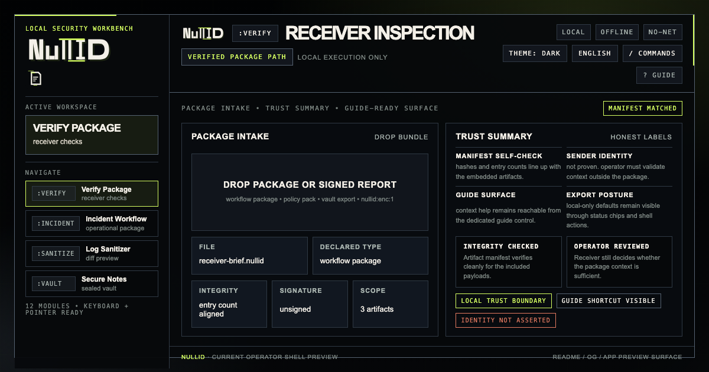

# NullID

Local-first browser/PWA and Node CLI security workbench for preparing, inspecting, and protecting sensitive files and text without runtime services.



## Key Capabilities

- Hash and verify text or files with SHA-256, SHA-512, and SHA-1 for legacy interoperability.
- Redact common secrets and personally identifiable data from text, logs, CSV, JSON, XML, YAML, and NDJSON.
- Prepare Safe Share and Incident Workflow packages with local review, warnings, transform history, and SHA-256 artifact manifests.
- Inspect workflow packages, safe-share bundles, policy packs, profile snapshots, vault snapshots, and `NULLID:ENC` envelopes.
- Inspect and clean supported image metadata in the browser; clean PDF, Office, and archive inputs through the local CLI.
- Encrypt and decrypt files or snippets with `NULLID:ENC:2` envelopes using PBKDF2, AES-GCM, and authenticated header metadata.
- Keep encrypted local notes in the Secure Notes vault with auto-lock, panic lock, optional local WebAuthn MFA, and explicit storage warnings.
- Generate passphrases and create one-way password storage records with Argon2id when available or PBKDF2-SHA256 for compatibility.
- Run as an installable PWA with offline app-shell caching.
- Use the documented Node CLI for offline automation workflows.

## Security And Privacy Model

NullID is designed to run locally. The browser app has no required backend, analytics, or runtime external API calls, and `npm run lint:network` enforces that policy across runtime source and public assets.

Important boundaries:

- Local-first does not mean cryptographic certification. NullID uses standard primitives and defensive validation, but it is not an externally audited cryptography product.
- `NULLID:ENC:2` is the current encryption envelope format. Legacy `NULLID:ENC:1` envelopes remain read/decrypt compatible, but their filename and MIME metadata are unauthenticated.
- Workflow packages use SHA-256 artifact manifests. They can detect changes to listed artifacts, but they do not prove sender identity.
- Shared-passphrase HMAC metadata helps parties that already share a passphrase detect tampering in profile, policy, and vault exports. It is not public-key identity.
- Profile export/import excludes vault blobs and vault-store metadata. Export vault content separately.
- Secure Notes uses canonical vault note version 3 and vault snapshot schema 2. Unsupported v1, v2, unversioned, schema-less, and obsolete fallback-key vault data is ignored during normal reads and imports.
- If IndexedDB is unavailable, the current generation-backed localStorage fallback keeps vault contents encrypted, but ciphertext blobs and record metadata are visible to that browser profile until wipe.
- Explicit vault wipe may remove obsolete NullID vault namespaces without interpreting their contents.
- Metadata cleaning is format-dependent and best-effort; review outputs before sharing.
- Password storage hashes are one-way verifier records, not encrypted secrets. There is no decrypt path for the original password.
- Browser JavaScript cannot set `HttpOnly` cookies. Any server-side session boundary must be configured at the host or edge layer.

See [docs/threat-model.md](./docs/threat-model.md) for the full threat model.

## Quick Start

Requirements:

- Node.js `^20.19.0 || >=22.12.0`
- npm

Install dependencies:

```bash
npm ci
```

Run the browser app:

```bash
npm run dev
```

The Vite dev server listens on `http://127.0.0.1:4173` by default.

Run the local CLI help:

```bash
npm run cli -- help
```

Run the standard local validation path:

```bash
npm run validate
```

## CLI Examples

Hash a file:

```bash
npm run cli -- hash ./artifact.bin --algo sha512
```

Sanitize one log file:

```bash
npm run cli -- sanitize ./raw.log ./clean.log --preset nginx
```

Sanitize a directory with a baseline policy:

```bash
npm run cli -- sanitize-dir ./logs ./logs-clean --baseline ./nullid.policy.json --ext .log,.json --report ./sanitize-report.json
```

Create and inspect a safe-share bundle:

```bash
npm run cli -- bundle ./raw.log ./nullid-safe-share-bundle.json --preset nginx --workflow support-ticket
npm run cli -- package-inspect ./nullid-safe-share-bundle.json
```

Inspect an encrypted workflow package:

```bash
npm run cli -- package-inspect ./received.nullid --pass-env NULLID_PASSPHRASE
```

Encrypt and decrypt a file:

```bash
npm run cli -- enc ./secret.txt ./secret.nullid --pass-env NULLID_PASS --profile strong
npm run cli -- dec ./secret.nullid ./secret.decrypted.txt --pass-env NULLID_PASS
```

Create and verify a password storage record:

```bash
NULLID_PASSWORD='correct horse battery staple' npm run cli -- pw-hash --password-env NULLID_PASSWORD --algo pbkdf2-sha256
NULLID_PASSWORD='correct horse battery staple' npm run cli -- pw-verify --record '$pbkdf2-sha256$i=600000$...' --password-env NULLID_PASSWORD
```

Inspect an archive against an expected manifest:

```bash
npm run cli -- archive-inspect ./evidence.zip --manifest ./nullid-archive-manifest.json --output ./archive-report.json
```

## Runtime And Browser Scope

Supported release scope:

- Browser/PWA source and static build output.
- Local Node CLI in [scripts/nullid-local.mjs](./scripts/nullid-local.mjs).
- Node.js versions matching `package.json` engines.
- Current Chromium-family, Firefox, and Safari-family browsers with WebCrypto, IndexedDB, File, Blob, and service worker support.

Optional desktop bootstrap:

- [desktop/tauri](./desktop/tauri/README.md) is an experimental Tauri packaging bootstrap.
- `desktop/tauri/src-tauri/tauri.conf.json` currently sets `bundle.active` to `false`, so this repository does not ship a supported native desktop distribution.
- Rust/Cargo validation is required only for a future release that explicitly includes a desktop binary.
- Missing Rust/Cargo validation does not block browser/PWA or CLI release readiness.

## Testing And Verification

Common commands:

```bash
npm run typecheck
npm run i18n:check
npm run docs:links
npm run lint
npm run lint:network
npm run dead-code
npm run duplicate-code
npm test
npm run test:e2e
npm run test:e2e:production
npm run build
npm run verify:build
npm run audit:headers
npm run release:bundle
npm run release:verify
```

`npm run validate` combines the browser/PWA, CLI, coverage, dependency audit, documentation link, E2E, build, and release-bundle checks used by the repository validation matrix.

For reproducible build checks:

```bash
SOURCE_DATE_EPOCH=1735689600 npm run build:repro
```

The browser/PWA and CLI source tree has passed the repository validation matrix. Live-host verification is performed separately after deployment.

## Known Limitations

- NullID does not replace a security review, legal review, incident command system, or password manager.
- Runtime compromise, malicious browser extensions, clipboard managers, and local account compromise are outside the app's control.
- Workflow package metadata is package-declared unless the same content is represented inside hashed artifacts.
- Schema-2 `nullid-safe-share` inspection is based on the embedded workflow package; duplicated outer wrapper fields are compatibility metadata.
- `NULLID:ENC:2` protects an exported file envelope for passphrase holders. It does not add sender identity.
- Argon2id support depends on the runtime. PBKDF2-SHA256 remains the compatibility fallback.
- PBKDF2 is CPU-hard, not memory-hard.
- Local WebAuthn MFA is device-bound and is not a vault recovery system.
- localStorage fallback exposes encrypted vault blobs and metadata to the browser profile.
- Static-host headers must be verified on the real deployed host; repository header files are baselines, not proof of host behavior.

## Documentation

- [Safe Share Assistant](./docs/safe-share-assistant.md)
- [Incident Workflow](./docs/incident-workflow.md)
- [Verify Package](./docs/verify-package.md)
- [Workflow package contract](./docs/workflow-package-contract.md)
- [Password storage hashing](./docs/password-storage-hashing.md)
- [Recovery runbook](./docs/recovery-runbook.md)
- [Release readiness](./docs/release-readiness.md)
- [Release runbook](./docs/release-runbook.md)
- [Deployment verification checklist](./docs/deployment-verification-checklist.md)
- [Shared-passphrase HMAC conventions](./docs/signed-workflow-conventions.md)
- [Threat model](./docs/threat-model.md)
- [Security policy](./SECURITY.md)
- [Contributing](./CONTRIBUTING.md)
- [Support](./SUPPORT.md)
- [Code of Conduct](./CODE_OF_CONDUCT.md)

## Contributing And Security Reporting

See [CONTRIBUTING.md](./CONTRIBUTING.md) before proposing changes. Keep browser and CLI behavior aligned for shared features, update tests for behavior changes, and run `npm run validate` before requesting review.

Report security issues privately through the channels in [SECURITY.md](./SECURITY.md). Do not open public issues for vulnerabilities.

## License

MIT. See [LICENSE](./LICENSE).
